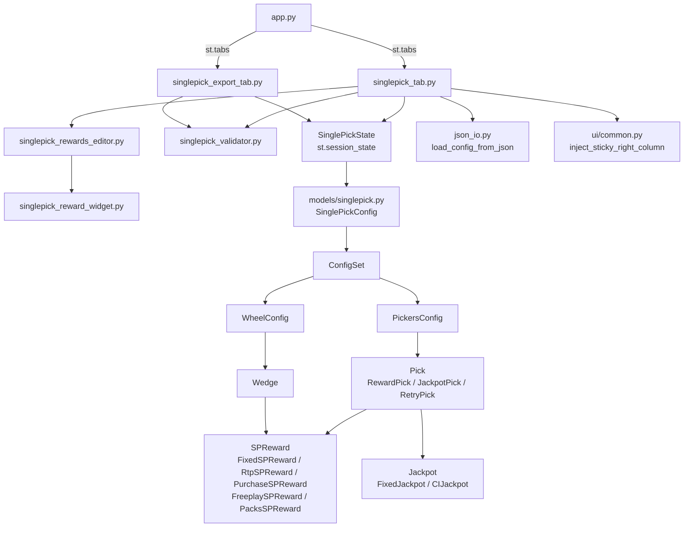

# Design Document — SinglePick Tab

## Overview

Добавление новой вкладки **"🎰 SinglePick"** в приложение LiveEvent JSON Builder.
Вкладка предоставляет полноценный UI для создания, редактирования и экспорта JSON-конфигов по схеме SinglePick (`ConfigSets`).

Схема SinglePick независима от схемы LiveEvent: у неё отдельный корневой ключ (`ConfigSets`), отдельные модели данных и отдельное состояние. Вкладка интегрируется в существующий `app.py` по тому же паттерну, что и `editor_tab` / `export_tab`. Экспорт вынесен в отдельную вкладку **"📤 Экспорт SinglePick"** (`singlepick_export_tab.py`).

### Ключевые решения

- **Изолированное состояние** — `SinglePickState` хранится в `st.session_state["singlepick_state"]`, не пересекается с `AppState`.
- **Собственные модели** — новый модуль `models/singlepick.py` с иерархией dataclass-ов, наследующих `Serializable`.
- **Переиспользование сервисов** — `load_config_from_json` из `services/json_io.py` используется для загрузки файлов (поддержка UTF-8/BOM/CP1251).
- **Виджет наград** — `singlepick_reward_widget.py` для одной награды SinglePick (5 типов), `singlepick_rewards_editor.py` — редактор списка наград; оба отдельны от существующих `reward_widget.py` / `rewards_editor.py`, так как наборы типов различаются.
- **Липкая правая панель** — `inject_sticky_right_column()` из `ui/common.py` делает правую колонку редактора фиксированной при прокрутке.
- **Валидация** — отдельный модуль `services/singlepick_validator.py`, возвращающий список ошибок.
- **Сборка JSON** — метод `to_dict()` на корневой модели `SinglePickConfig`, форматирование через `json.dumps(..., indent=4, ensure_ascii=False)`.
- **Дублирование** — ConfigSet, Pick и Wedge можно дублировать кнопкой 📋; копия вставляется сразу после оригинала. Для ConfigSet генерируется уникальное имя с суффиксом `_copy` / `_copy2` и т.д. Реализовано через `copy.deepcopy`.

---

## Architecture



### Слои

| Слой | Файлы | Ответственность |
|---|---|---|
| UI / Tab | `ui/tabs/singlepick_tab.py` | Рендеринг вкладки редактора, оркестрация виджетов |
| UI / Export Tab | `ui/tabs/singlepick_export_tab.py` | Валидация, предпросмотр, скачивание и копирование JSON |
| UI / Widgets | `ui/widgets/singlepick_rewards_editor.py` | Редактор списка наград (добавление, редактирование, удаление) |
| UI / Widgets | `ui/widgets/singlepick_reward_widget.py` | Форма одной награды SinglePick (5 типов) |
| UI / Common | `ui/common.py` | `inject_sticky_right_column()` — липкая правая панель |
| State | `SinglePickState` (в `singlepick_tab.py`) | Изолированное состояние вкладки |
| Models | `models/singlepick.py` | Dataclass-иерархия, `to_dict` / `from_dict` |
| Services | `services/singlepick_validator.py` | Валидация перед экспортом |
| Services | `services/json_io.py` | Загрузка файла (переиспользование) |

---

## Components and Interfaces

### `ui/tabs/singlepick_tab.py`

Главная функция вкладки:

```python
def render_singlepick_tab() -> None: ...
```

Внутренняя структура рендера:

```
render_singlepick_tab()
├── inject_sticky_right_column()   # липкая правая панель (из ui/common.py)
├── _render_toolbar()              # кнопка "Новый конфиг", загрузка файла, счётчик ConfigSet-ов
├── left_col: _render_tree()       # левая колонка: дерево с expander-ами по каждому ConfigSet
└── right_col: _render_editor()    # правая колонка: редактор выбранного элемента
    ├── форма нового ConfigSet (cs_name == "NEW_CS")
    ├── настройки ConfigSet (item_type == ""):
    │   ├── смена типа (confirm_type_change)
    │   └── TotalPickOnBoard / PickUntilWin (только для Pickers)
    ├── _render_reward_pick_form()  (item_type == "pick", RewardPick)
    ├── _render_jackpot_pick_form() (item_type == "pick", JackpotPick)
    ├── _render_retry_pick_form()   (item_type == "pick", RetryPick)
    └── _render_wedge_form()        (item_type == "wedge")
```

Все вспомогательные функции — приватные (префикс `_`), определены в том же файле.

#### Дублирование элементов

Дублирование реализовано непосредственно в `_render_tree()` через `copy.deepcopy`:

| Уровень | Кнопка | Поведение |
|---|---|---|
| ConfigSet | 📋 (рядом с ⚙️ и ❌) | Глубокая копия `ConfigSet`; уникальное имя `{name}_copy` / `{name}_copy2` ...; вставка сразу после оригинала через перестройку `dict` |
| Pick | 📋 (рядом с ✏️ и ↑↓) | `copy.deepcopy(pick)` → `pickers.picks.insert(i + 1, new_pick)` |
| Wedge | 📋 (рядом с ✏️ и ❌) | `copy.deepcopy(wedge)` → `wheel.wedges.insert(i + 1, new_wedge)` |

### `SinglePickState`

Dataclass, хранящийся в `st.session_state["singlepick_state"]`:

```python
@dataclass
class SinglePickState:
    config: SinglePickConfig
    # Что сейчас открыто в правой панели:
    #   ("", "", -1)            — ничего не выбрано
    #   ("NEW_CS", "", -1)      — форма нового ConfigSet
    #   (cs_name, "", -1)       — настройки ConfigSet (тип, TotalPickOnBoard и т.д.)
    #   (cs_name, "pick", i)    — редактор пика с индексом i
    #   (cs_name, "wedge", i)   — редактор сектора с индексом i
    editing: Tuple[str, str, int]
    confirm_delete_cs: str   # имя ConfigSet, ожидающего подтверждения удаления
    confirm_type_change: bool  # флаг ожидания подтверждения смены типа
```

Доступ:

```python
def get_singlepick_state() -> SinglePickState:
    if "singlepick_state" not in st.session_state:
        st.session_state["singlepick_state"] = SinglePickState(
            config=SinglePickConfig(config_sets={}),
            editing=("", "", -1),
            confirm_delete_cs="",
            confirm_type_change=False,
        )
    return st.session_state["singlepick_state"]
```

Все ключи `st.session_state`, создаваемые вкладкой, используют префикс `singlepick_` или `sp_`.

### `ui/tabs/singlepick_export_tab.py`

Отдельная вкладка экспорта:

```python
def render_singlepick_export_tab() -> None: ...
```

Функциональность:
- Читает `SinglePickState` через `get_singlepick_state()`.
- Запускает `validate_singlepick()` и отображает все ошибки перед кнопками.
- Кнопка скачивания (`st.download_button`) деактивирована при наличии ошибок или пустом конфиге.
- Кнопка "Copy to clipboard" реализована через JS-компонент (`_copy_button()`).
- Предпросмотр JSON с фильтром по ConfigSet (selectbox "— Весь конфиг —" / конкретный ConfigSet).
- Кнопка скачивания отдельного ConfigSet из предпросмотра.

### `services/singlepick_validator.py`

```python
@dataclass
class ValidationError:
    configset_name: str
    field: str
    message: str

def validate_configset_name(name: str, existing_names: list[str]) -> str | None: ...
def is_percentage_valid(percentage: float) -> bool: ...
def validate_singlepick(config: SinglePickConfig) -> list[ValidationError]: ...
```

Валидатор проверяет:
- Каждый ConfigSet содержит ровно один дочерний объект (Pickers или Wheel).
- В каждом Pickers список Picks содержит ≥ 1 элемент.
- В каждом Wheel список Wedges содержит ≥ 1 элемент.
- В каждом JackpotPick: `min <= max`.
- В каждом RtpSPReward: `percentage` имеет не более 3 знаков после запятой (шаг 0.001). Реальные конфиги используют значения вроде 0.028, поэтому допускается до 3 знаков включительно.
- Имена ConfigSet-ов уникальны и непусты.

### `ui/widgets/singlepick_rewards_editor.py`

```python
def render_sp_rewards_editor(
    prefix: str,
    existing_rewards: List[SPReward],
) -> List[SPReward]: ...

def get_default_sp_reward() -> SPReward: ...
```

Редактор списка наград: отображает список с кнопками ✏️ / ❌, форму добавления новой награды и форму редактирования существующей (через `render_sp_reward_widget`). Состояние хранится в `session_state` по ключу `{prefix}_sp_rewards`.

### `ui/widgets/singlepick_reward_widget.py`

```python
def render_sp_reward_widget(
    prefix: str,
    index: int,
    existing: Optional[SPReward] = None
) -> SPReward: ...
```

Поддерживает 5 типов наград SinglePick через selectbox с 12 метками:

| Метка UI | Тип модели | Поля |
|---|---|---|
| Chips | `FixedSPReward` | currency="Chips", amount |
| VariableChips | `RtpSPReward` | currency="Chips", percentage, min, max |
| MLM | `FixedSPReward` | currency="Tickets", amount |
| Loyalty Point | `FixedSPReward` | currency="Loyalty", amount |
| Vip Points | `FixedSPReward` | currency="VipPoints", amount |
| Sweepstakes | `FixedSPReward` | currency="Entries_Name", amount |
| BoardGameDices | `FixedSPReward` | currency="BoardGameDices", amount (min=1) |
| BoardGameBuilds | `FixedSPReward` | currency="BoardGameBuilds", amount (min=1) |
| BoardGameRareBuilds | `FixedSPReward` | currency="BoardGameRareBuilds", amount (min=1) |
| FreePlays | `FreeplaySPReward` | game_name, spins |
| Packs | `PacksSPReward` | pack_id, num_packs |
| PurchaseReward | `PurchaseSPReward` | shop_type, shop_name |

---

## Data Models

Все модели находятся в `models/singlepick.py` и наследуют `Serializable`.

### Иерархия

```
SinglePickConfig
└── config_sets: dict[str, ConfigSet]

ConfigSet
└── content: PickersConfig | WheelConfig

PickersConfig
├── picks: list[Pick]
├── total_pick_on_board: int
└── pick_until_win: int

WheelConfig
└── wedges: list[Wedge]

Pick = RewardPick | JackpotPick | RetryPick

RewardPick
├── reward: list[SPReward]
├── weight: int
└── possible_max: int

JackpotPick
├── jackpot: FixedJackpot | CIJackpot
├── weight: int
└── possible_max: int

RetryPick
├── reward: list[SPReward]   # необязательный, может быть пустым
├── weight: int
└── possible_max: int

Wedge
├── reward: list[SPReward]
└── weight: int

SPReward = FixedSPReward | RtpSPReward | PurchaseSPReward | FreeplaySPReward | PacksSPReward

FixedSPReward
├── currency: str
└── amount: int

RtpSPReward
├── currency: str
├── percentage: float
├── min: int
└── max: int

PurchaseSPReward
├── shop_type: str
└── shop_name: str

FreeplaySPReward
├── game_name: str
└── spins: int

PacksSPReward
├── pack_id: str
└── num_packs: int

FixedJackpot
├── min: int
└── max: int

CIJackpot
├── min: int
├── max: int
├── ci_min: int
└── ci_max: int
```

### Сериализация

Каждая модель реализует `to_dict()` и `from_dict()`. Пример для `SinglePickConfig`:

```python
# to_dict() → {"ConfigSets": {"Name": {...}}}
# from_dict({"ConfigSets": {...}}) → SinglePickConfig
```

Пример для `RewardPick`:

```python
# to_dict() → {"RewardPick": {"Reward": [...], "Weight": 1, "PossibleMax": 6}}
```

Пример для `Wedge` (сериализуется как `RewardPick` без `PossibleMax`):

```python
# to_dict() → {"RewardPick": {"Reward": [...], "Weight": 1}}
```

Пример для `CIJackpot` внутри `JackpotPick`:

```python
# to_dict() → {"JackpotPick": {"CIJackpot": {"Min": ..., "Max": ..., "CIMin": ..., "CIMax": ...}, "Weight": 1, "PossibleMax": 6}}
```

Пример для `FreeplaySPReward`:

```python
# to_dict() → {"FreeplayUnlockReward": {"GameName": "Buffalo", "Spins": 16}}
```

Пример для `PacksSPReward`:

```python
# to_dict() → {"CollectableSellPacksReward": {"PackId": "sellPack50", "NumPacks": 4}}
```

Пример для `PurchaseSPReward`:

```python
# to_dict() → {"PurchaseReward": {"ShopType": "...", "ShopName": "..."}}
```

### Загрузка из JSON

Используется существующий `load_config_from_json(file_content: bytes) -> dict` из `services/json_io.py`.
После получения словаря вызывается `SinglePickConfig.from_dict(data)`.
Если в словаре отсутствует ключ `ConfigSets` — выбрасывается `ValueError`, который перехватывается в UI.

---

## UI Layout

Вкладка **"🎰 SinglePick"** использует двухпанельный макет: дерево слева, редактор справа.

```
┌─────────────────────────────────────────────────────────────────┐
│  🆕 Новый конфиг  │  📂 Загрузить JSON          │  📊 N         │
├─────────────────────────────────────────────────────────────────┤
│  ┌──────────────────────────┐  ┌──────────────────────────────┐ │
│  │  🌳 Структура            │  │  (липкая правая панель)      │ │
│  │                          │  │                              │ │
│  │  ➕ Добавить ConfigSet   │  │  ➕ Новый ConfigSet          │ │
│  │                          │  │  — или —                     │ │
│  │  🃏 Name1 `Pickers`      │  │  ⚙️ Настройки cs_name        │ │
│  │    ⚙️ Настройки 📋 ❌    │  │    Тип: ● Pickers ○ Wheel   │ │
│  │    🔹 1. RewardPick ...  │  │    TotalPickOnBoard: [12]    │ │
│  │       ✏️ � ↑ ↓ ❌       │  │    PickUntilWin: [0]         │ │
│  │    🔹 2. JackpotPick ... │  │  — или —                     │ │
│  │       ✏️ 📋 ↑ ↓ ❌       │  │  ✏️ cs_name → RewardPick #1  │ │
│  │    ➕ [тип] ➕           │  │    Weight / PossibleMax      │ │
│  │                          │  │    [Редактор наград]         │ │
│  │  🎡 Name2 `Wheel`        │  │                              │ │
│  │    ⚙️ Настройки � ❌    │  │                              │ │
│  │    �🔸 1. Wedge ...       │  │                              │ │
│  │       ✏️ 📋 ❌           │  │                              │ │
│  │    ➕ Добавить сектор    │  │                              │ │
│  └──────────────────────────┘  └──────────────────────────────┘ │
└─────────────────────────────────────────────────────────────────┘
```

Вкладка **"📤 Экспорт SinglePick"** — отдельный файл `singlepick_export_tab.py`:

```
┌─────────────────────────────────────────────────────────────────┐
│  📤 Экспорт SinglePick                                          │
│  ConfigSet-ов в конфиге: N                                      │
│                                                                 │
│  [Ошибки валидации, если есть]                                  │
│                                                                 │
│  📥 Скачать SinglePickConfig.json  │  Copy to clipboard         │
│                                                                 │
│  ─────────────────────────────────────────────────────────────  │
│  🔍 Предпросмотр JSON                                           │
│  Выберите ConfigSet: [— Весь конфиг — ▼]  👁️ Показать JSON     │
│                                                                 │
│  📄 JSON (expander)                                             │
│  [JSON code block]                                              │
│  📥 Скачать fragment.json  │  Copy to clipboard                 │
└─────────────────────────────────────────────────────────────────┘
```

---

## Correctness Properties

*A property is a characteristic or behavior that should hold true across all valid executions of a system — essentially, a formal statement about what the system should do. Properties serve as the bridge between human-readable specifications and machine-verifiable correctness guarantees.*

### Property 1: Валидация имени ConfigSet

*For any* набора существующих имён ConfigSet-ов и нового имени — валидатор должен отклонять пустую строку и любое имя, совпадающее с уже существующим, и принимать любое непустое уникальное имя.

**Validates: Requirements 2.2, 2.3**

---

### Property 2: Сериализация round-trip

*For any* валидного объекта `SinglePickConfig` — сериализация через `to_dict()` с последующей десериализацией через `from_dict()` должна давать эквивалентный объект.

**Validates: Requirements 9.2, 10.2**

---

### Property 3: Корневой ключ экспорта

*For any* состояния `SinglePickState` с хотя бы одним ConfigSet — сериализованный JSON должен содержать корневой ключ `ConfigSets`, а его значение должно содержать все ConfigSet-ы из состояния.

**Validates: Requirements 10.2, 10.3**

---

### Property 4: Валидация Min/Max в джекпоте

*For any* пары целых чисел `(min, max)` — если `min > max`, валидатор должен возвращать ошибку для соответствующего поля; если `min <= max`, ошибки быть не должно.

**Validates: Requirements 6.5**

---

### Property 5: Валидация Percentage в RtpReward

*For any* значения `percentage` типа float — если оно имеет более 3 знаков после запятой (т.е. не кратно 0.001), валидатор должен возвращать ошибку; если количество знаков после запятой не превышает 3 — ошибки быть не должно. Значения вроде 0.028 считаются корректными.

**Validates: Requirements 5.5**

---

### Property 6: Валидация непустых списков Picks и Wedges

*For any* объекта `SinglePickConfig` — если хотя бы один `PickersConfig` содержит пустой список `Picks` или хотя бы один `WheelConfig` содержит пустой список `Wedges`, валидатор должен возвращать соответствующую ошибку; для непустых списков ошибки быть не должно.

**Validates: Requirements 4.3, 8.2, 11.2, 11.3**

---

### Property 7: Перестановка пиков

*For any* списка пиков длиной ≥ 2 и индекса `i` (0 < i < len) — операция "переместить вверх" для элемента `i` должна поменять местами элементы `i` и `i-1`, не изменяя остальные элементы и не изменяя длину списка.

**Validates: Requirements 4.4**

---

### Property 8: Дублирование ConfigSet

*For any* словаря `config_sets` и имени `cs_name` — операция дублирования должна:
1. Увеличивать количество ConfigSet-ов ровно на 1.
2. Создавать копию с именем, отличным от всех существующих имён.
3. Не изменять оригинальный ConfigSet (глубокая независимость копии).
4. Вставлять копию на позицию сразу после оригинала.

**Validates: Requirements 2.5**

---

## Error Handling

| Ситуация | Поведение |
|---|---|
| Загружен файл без ключа `ConfigSets` | `st.error(...)`, состояние не изменяется |
| Файл не является валидным JSON | `st.error(...)`, состояние не изменяется |
| Ошибки валидации при экспорте | `st.error(...)` с количеством ошибок + `st.warning(...)` для каждой, кнопка скачивания деактивирована |
| Попытка добавить ConfigSet с дублирующимся именем | `st.error(...)` inline, форма не закрывается |
| Попытка добавить ConfigSet с пустым именем | `st.error(...)` inline |
| `Min > Max` в джекпоте | `st.error(...)` inline в форме пика |
| `Percentage` имеет более 3 знаков после запятой | ошибка валидации в `singlepick_export_tab` |
| Удаление ConfigSet | Запрос подтверждения через `st.warning` + кнопки "✅ Да" / "❌ Нет" |
| Смена типа ConfigSet | Запрос подтверждения через `st.warning` + кнопки "✅ Да" / "❌ Нет" |
| Сброс состояния при наличии данных | Запрос подтверждения через `st.warning` + кнопки "✅ Да" / "❌ Нет" |
| Экспорт при пустом `ConfigSets` | `st.info(...)`, кнопка скачивания деактивирована |

---

## Testing Strategy

### Подход

Используется двойная стратегия: **unit-тесты** для конкретных примеров и граничных случаев, **property-based тесты** для универсальных свойств.

Для property-based тестирования используется библиотека **[Hypothesis](https://hypothesis.readthedocs.io/)** (Python). Каждый property-тест запускается минимум **100 итераций** (настройка `@settings(max_examples=100)`).

### Unit-тесты (`tests/test_singlepick_models.py`, `tests/test_singlepick_validator.py`)

- Сериализация/десериализация конкретных примеров (включая все 5 типов SPReward).
- Проверка сериализации `Wedge` как `RewardPick` без поля `PossibleMax`.
- Загрузка файлов в кодировках UTF-8, UTF-8-BOM, CP1251.
- Проверка сообщений об ошибках при невалидном JSON.
- Проверка поведения UI при пустом состоянии (предупреждение, деактивация кнопки).
- Проверка CRUD операций с ConfigSet-ами (добавление, переименование, удаление).

### Property-based тесты (`tests/test_singlepick_properties.py`)

Каждый тест аннотирован тегом в формате:
`# Feature: singlepick-tab, Property N: <текст свойства>`

**Property 1** — `@given(existing_names=..., new_name=...)`:
Валидатор имён ConfigSet корректно отклоняет пустые и дублирующиеся имена.
`# Feature: singlepick-tab, Property 1: Валидация имени ConfigSet`

**Property 2** — `@given(config=st.from_type(SinglePickConfig))`:
Round-trip `to_dict()` → `from_dict()` сохраняет эквивалентность.
`# Feature: singlepick-tab, Property 2: Сериализация round-trip`

**Property 3** — `@given(state=...)`:
Экспортированный JSON содержит корневой ключ `ConfigSets` со всеми ConfigSet-ами.
`# Feature: singlepick-tab, Property 3: Корневой ключ экспорта`

**Property 4** — `@given(min_val=st.integers(), max_val=st.integers())`:
Валидатор Min/Max джекпота корректен для всех пар чисел.
`# Feature: singlepick-tab, Property 4: Валидация Min/Max в джекпоте`

**Property 5** — `@given(percentage=st.floats(min_value=0.0, max_value=1.0))`:
Валидатор Percentage корректен: значения с ≤ 3 знаками после запятой (включая 0.028) принимаются, с > 3 знаками — отклоняются.
`# Feature: singlepick-tab, Property 5: Валидация Percentage в RtpReward`

**Property 6** — `@given(config=...)`:
Валидатор корректно обнаруживает пустые списки Picks/Wedges.
`# Feature: singlepick-tab, Property 6: Валидация непустых списков`

**Property 7** — `@given(picks=st.lists(..., min_size=2), idx=st.integers(min_value=1))`:
Операция "переместить вверх" корректно переставляет элементы.
`# Feature: singlepick-tab, Property 7: Перестановка пиков`

**Property 8** — `@given(config_sets=..., cs_name=st.text())`:
Дублирование ConfigSet создаёт независимую копию с уникальным именем на позиции сразу после оригинала.
`# Feature: singlepick-tab, Property 8: Дублирование ConfigSet`
